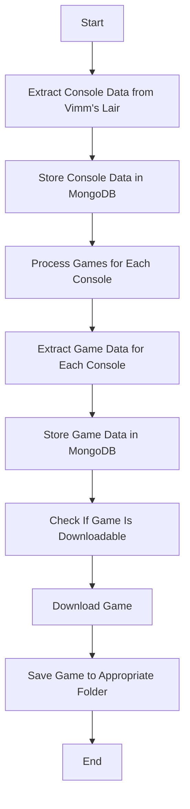

# Vimm's Lair Crawler

This project is a web crawler designed to extract and download game data from [Vimm's Lair](https://https://vimm.net/). It leverages asynchronous operations and web scraping techniques to gather information about video game consoles, their games, and game download links. The extracted data is saved in a MongoDB database for further processing.

## Features
- Scrapes console and handheld data from Vimm's Lair.
- Extracts game data for each console, including game name, region, publisher, and download URLs.
- Verifies if a game is downloadable and handles download operations.
- Organizes downloaded ROMs by console and saves them in a local folder.
- Uses MongoDB to store game and console data for later processing.
  
## Project Structure

```
.
├── README.md                    # Project documentation
├── docker-compose.yml           # Docker Compose configuration
├── docker                       # Docker configuration files
├── src
│   ├── config.py                 # Configuration for MongoDB and other settings
│   ├── console_data_extractor.py # Extracts console data from Vimm's Lair
│   ├── game_data_extractor.py    # Extracts individual game data
│   ├── game_download_checker.py  # Verifies if games are downloadable and downloads them
├── requirements.txt              # Python dependencies
├── run_download.py               # Main entry point for running the crawler
├── run_inflate.py                # Main entry point for inflating the downloaded roms

```

## How It Works

1. **Console Data Extraction**: The `ConsoleDataExtractor` class scrapes the Vimm's Lair website to gather data about consoles and handheld devices. It retrieves the name, year, and URL for each console and stores it in MongoDB.
   
2. **Game Data Extraction**: The `GameDataExtractor` class scrapes each console's page to collect data about the games available for that console. This includes game name, region, publisher, and more. It also extracts the download URL for games that are downloadable.

3. **Download Process**: The `GameDownloadChecker` class checks whether each game is downloadable by verifying the presence of a download URL and flags. If the game is downloadable, it downloads the game using `requests` and saves it in a directory structure based on the console.

4. **MongoDB**: MongoDB is used to store both console and game data. It keeps track of the consoles and games extracted from the Vimm's Lair website, including details like download URLs and game metadata.

## Flow Diagram (Mermaid)



## Prerequisites

To run the project, you need:

- Python 3.7 or higher
- Docker and Docker Compose for MongoDB

### Dependencies
- `requests` for HTTP requests
- `aiohttp` for asynchronous HTTP requests
- `beautifulsoup4` for HTML parsing
- `tqdm` for progress bars during downloads
- `pydantic-settings` for configuration management
- `mongoengine` for MongoDB integration

### Installation

1. **Install Dependencies**:
   Create a Python virtual environment and install the required dependencies using the following command:

   ```bash
   pip install -r requirements.txt
   ```

2. **Run MongoDB using Docker Compose**:
   MongoDB and the MongoDB Express UI are run using Docker Compose. The `docker-compose.yml` file is already configured for the necessary MongoDB services.

   To run the services:

   ```bash
   docker-compose up -d
   ```

   This will start MongoDB and MongoDB Express. You can access MongoDB Express at `http://localhost:8081` using the username `admin` and password `vimmlair`.

3. **Run the Crawler**:
   Run the following command to start the game data extraction process:

   ```bash
   python run_inflate.py # To inflate the downloaded roms
   python run_download.py # To download the roms
   ```
   
4. **Access MongoDB**:
   You can view and manage the MongoDB data using MongoDB Express. It is accessible on [http://localhost:8081](http://localhost:8081).

## Docker Compose Configuration

The `docker-compose.yml` file defines two services: `mongo` (the MongoDB service) and `mongo-express` (the MongoDB management interface).

### Configuration

```yaml
version: "3.9"
services:

  mongo-express:
    container_name: mongo-express
    restart: unless-stopped
    image: mongo-express
    environment:
      ME_CONFIG_BASICAUTH_USERNAME: admin
      ME_CONFIG_BASICAUTH_PASSWORD: vimmlair
      ME_CONFIG_MONGODB_ADMINUSERNAME: root
      ME_CONFIG_MONGODB_ADMINPASSWORD: vimmlair
      ME_CONFIG_MONGODB_SERVER: mongo
    ports:
      - 8081:8081
    links:
      - mongo
    networks:
      - vimmlair-crawler

  mongo:
    container_name: mongo
    restart: unless-stopped
    image: mongodb/mongodb-atlas-local
    environment:
      MONGODB_INITDB_ROOT_USERNAME: root
      MONGODB_INITDB_ROOT_PASSWORD: vimmlair
    ports:
      - 27017:27017
    volumes:
      - mongo-data:/data/db
    networks:
      - vimmlair-crawler

volumes:
  mongo-data:
    driver: local

networks:
  vimmlair-crawler:
    driver: bridge
```

### Environment Variables

- **ME_CONFIG_BASICAUTH_USERNAME**: The username for accessing MongoDB Express.
- **ME_CONFIG_BASICAUTH_PASSWORD**: The password for MongoDB Express.
- **ME_CONFIG_MONGODB_ADMINUSERNAME**: The MongoDB root username.
- **ME_CONFIG_MONGODB_ADMINPASSWORD**: The MongoDB root password.
- **ME_CONFIG_MONGODB_SERVER**: The address of the MongoDB server (in this case, `mongo`).

### Running MongoDB with Docker

To start the MongoDB services with Docker Compose, run:

```bash
docker-compose up -d
```

You can then access MongoDB Express at `http://localhost:8081` to monitor the MongoDB database and view the stored console and game data.

---

Feel free to contribute or reach out if you have any questions or improvements!
